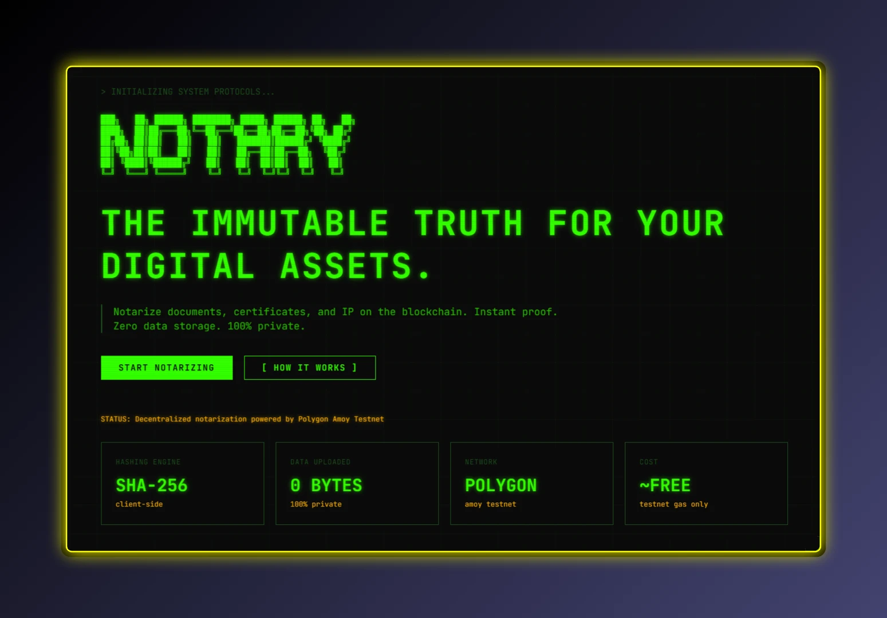

# NotaryNode

> **The Immutable Truth for Your Digital Assets.**

Notarize documents, certificates, and IP on the blockchain. Instant proof. Zero data storage. 100% Private.


---

## Interface



---

## What is NotaryNode?

NotaryNode is a **decentralized evidence management** web application that allows users to prove the existence of any digital file at a specific point in time — **without ever uploading the file itself**.

It works by generating a **SHA-256 cryptographic fingerprint** of your file entirely in the browser, then storing that fingerprint on the **Polygon Amoy blockchain** with an immutable timestamp. The actual file never leaves your machine.

> **Zero bytes of your file are ever sent to any server.** Open Chrome DevTools Network tab during upload to verify.

---

## Features

| Feature | Description |
|---|---|
| **Client-Side Hashing** | SHA-256 fingerprint generated locally via Web Crypto API |
| **MetaMask Integration** | One-click wallet connection with auto network switching |
| **On-Chain Proof** | Immutable timestamp stored on Polygon Amoy Testnet |
| **Instant Verification** | Re-upload any file to check if it was previously notarized |
| **Terminal CLI UI** | Cinematic hacker aesthetic with CRT scanlines and ASCII art |
| **Framer Motion** | Typewriter headlines, glitch effects, and smooth transitions |
| **Responsive** | Works on desktop and mobile devices |
| **Zero Data Storage** | No servers, no databases, no file uploads |

---

## Use Cases

- **Digital Certificates** — Verify university degrees and diplomas
- **Property Records** — Immutable ownership trails for real estate
- **Patents and IP** — Prove "First to Invent" without exposing secrets
- **Legal Contracts** — Prevent back-dating of agreements
- **Product Authentication** — Verify luxury goods and warranties
- **Evidence Archiving** — Tamper-proof digital evidence for courts

---

## Tech Stack

**Frontend:** Next.js 16, Tailwind CSS 4, Framer Motion, Lucide Icons

**Web3:** Ethers.js 6, MetaMask, Solidity ^0.8.20

**Network:** Polygon Amoy Testnet (Chain ID: 80002)

---

## Getting Started

### Prerequisites

- **Node.js** 18+ installed
- **MetaMask** browser extension
- **Testnet POL** from [Polygon Faucet](https://faucet.polygon.technology/)

### Installation

```bash
# Clone the repository
git clone https://github.com/yourusername/NotaryNode.git
cd NotaryNode

# Install dependencies
npm install

# Start development server
npm run dev
```

Open [http://localhost:3000](http://localhost:3000) in your browser.

### Smart Contract Deployment

The Solidity contract is located at `contracts/Notary.sol`. To deploy:

1. Open [Remix IDE](https://remix.ethereum.org/)
2. Create a new file `Notary.sol` and paste the contract code
3. Compile with Solidity `^0.8.20`
4. Set Environment to **Injected Provider - MetaMask**
5. Ensure MetaMask is on **Polygon Amoy Testnet**
6. Click **Deploy** and confirm the transaction
7. Copy the deployed contract address
8. Update `CONTRACT_ADDRESS` in `lib/web3.ts`

---

## Project Structure

```
NotaryNode/
├── app/
│   ├── globals.css        # Terminal CLI design system
│   ├── layout.tsx         # Root layout with CRT effects
│   └── page.tsx           # Main landing page
├── components/
│   ├── WalletConnect.tsx  # MetaMask connection handler
│   ├── Vault.tsx          # File drag-and-drop + SHA-256
│   └── FeatureGrid.tsx    # Use case terminal cards
├── contracts/
│   └── Notary.sol         # Solidity smart contract
├── lib/
│   └── web3.ts            # Ethers.js blockchain bridge
└── public/
    └── notary.webp        # Homepage screenshot
```

---

## Smart Contract

```solidity
// SPDX-License-Identifier: MIT
pragma solidity ^0.8.20;

contract Notary {
    mapping(bytes32 => uint256) public proofs;

    event Notarized(
        address indexed owner,
        bytes32 indexed fileHash,
        uint256 timestamp
    );

    function notarize(bytes32 _hash) public {
        require(proofs[_hash] == 0, "File has already been notarized");
        proofs[_hash] = block.timestamp;
        emit Notarized(msg.sender, _hash, block.timestamp);
    }

    function verify(bytes32 _hash) public view returns (uint256) {
        return proofs[_hash];
    }
}
```

**Deployed on Polygon Amoy:** `0x66e7dEFCeca8351d088958011D0e2e79700d01Cc`

---

## Testing

| Test | How to Verify |
|---|---|
| **Privacy Proof** | Open DevTools Network tab during file upload. Zero bytes transmitted. |
| **Wallet Connection** | MetaMask connects and auto-switches to Polygon Amoy. |
| **Notarization** | Upload file, seal, transaction confirmed on Polygonscan. |
| **Immutability** | Re-upload same file shows original timestamp. Modify 1 byte shows "not found". |

---

## Build for Production

```bash
npm run build
```

Deploy to Vercel for instant hosting:

```bash
npx vercel
```

---

## License

This project is licensed under the **MIT License**.

---

**© 2026 Hariom Phogat — NotaryNode: Decentralized Evidence Management**